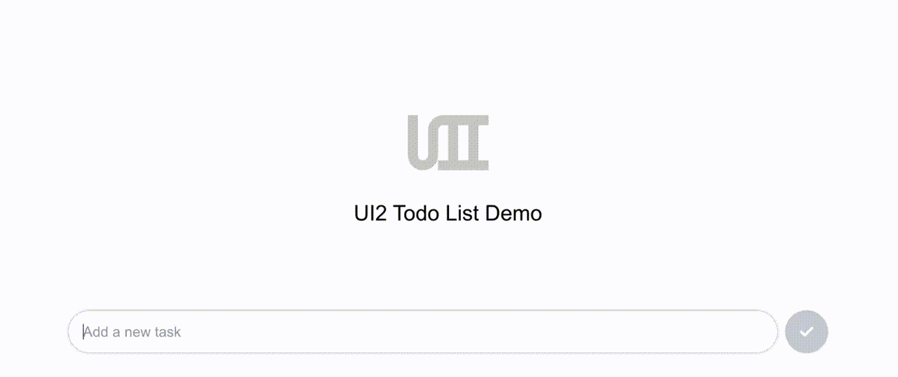

# UI2: The Unified Intent Interface



> A UI2-powered todo app, showing **Intent Detection** and **Instant Preview**

UI2 seeks to directly convert user intention into action. Think if an assistant like Siri was implemented directly into an application—but you can type to it, and due to its deep integration, it's accurate, powerful, and _fast_.

And not only that, you can see exactly what that assistant would do as you are typing.

Learn more and get started with development at [ui2-docs.vercel.app](https://ui2-docs.vercel.app)

## The Problem

The idea of the User Interface has always been the same since it's creation.

1. You have an **intention** to do something
2. You formulate how to **translate** that Intention into Actions
3. You take those **actions** on the UI to achieve your goal

But imagine a world where there is no barrier between **intention** and **action**. One where you can directly express your **Intent**—and have the computer handle the rest for you.

That very _idea_ is UI2.

## What is UI2?

UI2, or the **Unified Intent Interface** is a framework for a natural-language interface to any application.

It is powered by the idea of **Intent Identification**, merging all the intents in your app—searching, taking action, and more—into a single natural language interface.

UI2 can be described with four core ideas:

1. **Unification**: Search, taking action, and everything else you can do on an application should not be separate interfaces, but rather unified into one.
2. **Intent Detection**: The key point in combining these interfaces is identifying the user intent, now possible through LLMs
3. **Context**: Not only is intent detection based off of the text that you are typing, it also draws context from everything in your app—Allowing more powerful and more accurate intents.
4. **Instant Preview**: Imagine autocomplete for _actions_—not just words, in which you can "preview-before-committing."

## Examples

See examples in the `/examples` directory. It includes:

- [**Basic Quick Start**](https://github.com/EvanZhouDev/ui2/tree/main/examples/quick-start): Source code for the basic [Quick Start in the UI2 Docs](https://ui2-docs.vercel.app/quick-start/overview)
- [**React Quick Start**](https://github.com/EvanZhouDev/ui2/tree/main/examples/react-quick-start): Source code for the [React Quick Start in the UI2 Docs](https://ui2-docs.vercel.app/react-quick-start/overview)
- [**Todo App Example**](https://github.com/EvanZhouDev/ui2/tree/main/examples/todo-list): Source code for the todo app shown at the top of this README

## Install

Install with NPM, or your favorite package manager.

```bash
npm i ui2-sdk
```

## Get Started

Learn more and get started with development at [ui2-docs.vercel.app](https://ui2-docs.vercel.app)
